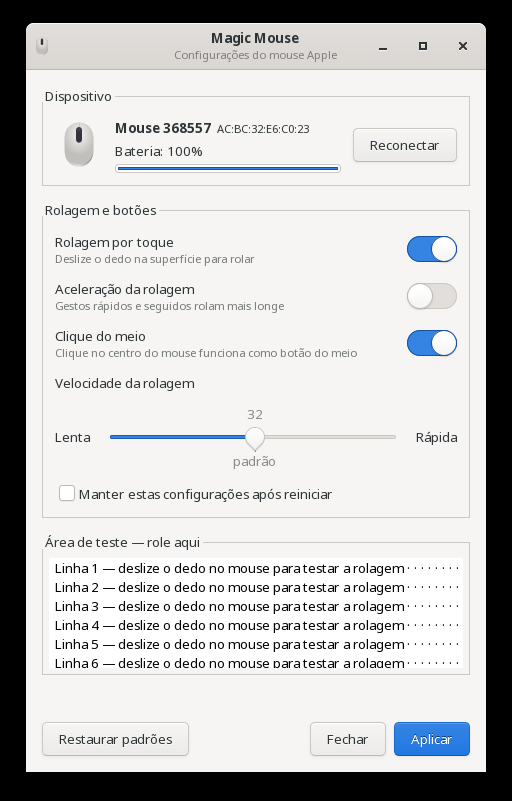

# Magic Mouse — Configurador para XFCE

Aplicativo gráfico (GTK3) para configurar o **Apple Magic Mouse** no Linux com XFCE.
Permite ajustar a rolagem por toque, a velocidade, a aceleração e o clique do meio
sem editar arquivos de configuração à mão.



## Funcionalidades

- **Detecção automática** do Magic Mouse conectado via Bluetooth, com nome, endereço e nível de bateria.
- **Rolagem por toque** — liga/desliga a rolagem deslizando o dedo na superfície.
- **Velocidade da rolagem** — de 0 (lenta) a 63 (rápida); o padrão do driver é 32.
- **Aceleração da rolagem** — gestos rápidos e seguidos rolam mais longe.
- **Clique do meio** — clicar no centro do mouse funciona como botão do meio.
- **Aplicação imediata** — as mudanças valem na hora, sem reconectar o mouse.
- **Persistência opcional** — mantém as configurações após reiniciar.
- **Botão Reconectar** — corrige a perda de rolagem após carregar o mouse no cabo USB.
- **Área de teste** — para experimentar a rolagem dentro do próprio aplicativo.

## Requisitos

Testado no **Fedora 44 com XFCE 4** (sessão X11), com o Magic Mouse 2.

- Python 3 com PyGObject e GTK 3 (`python3-gobject`, `gtk3`)
- BlueZ (`bluetoothctl`)
- polkit (`pkexec`)
- Driver do kernel `hid_magicmouse` (já incluído no kernel do Fedora)

No Fedora, todos costumam vir instalados com o XFCE. Se faltar algo:

```bash
sudo dnf install python3-gobject gtk3 bluez polkit
```

## Instalação

1. **Parte do usuário** — o comando e o atalho no menu:

   ```bash
   cd ~/projetos/magicmouse-config
   ln -sf "$PWD/magicmouse-config" ~/.local/bin/magicmouse-config
   cp magicmouse-config.desktop ~/.local/share/applications/
   ```

2. **Parte do sistema** — o auxiliar e a política polkit (pede senha uma única vez):

   ```bash
   sudo ./install.sh
   ```

## Uso

Abra por um destes caminhos:

- Menu de aplicativos → **Configurações → Magic Mouse**
- **Gerenciador de Configurações** do XFCE → seção Hardware
- Terminal: `magicmouse-config`

Ajuste as opções e clique em **Aplicar**. O sistema pedirá a senha de administrador; ela fica
memorizada por alguns minutos, permitindo vários ajustes seguidos.

Marque **"Manter estas configurações após reiniciar"** para torná-las permanentes.
Desmarcar e aplicar remove a configuração permanente.

## Solução de problemas

**A rolagem parou de funcionar (o cursor e os cliques funcionam).**
Isso costuma acontecer depois de carregar o Magic Mouse 2 no cabo USB e voltar a usá-lo
sem fio: o modo multitoque, necessário para a rolagem, não é reativado. Clique em
**Reconectar** no aplicativo, ou rode no terminal:

```bash
bluetoothctl disconnect <MAC-do-mouse> && bluetoothctl connect <MAC-do-mouse>
```

**"Nenhum Magic Mouse conectado".**
Verifique se o mouse está ligado e pareado (`bluetoothctl devices Connected`).

**"O auxiliar não está instalado".**
Rode `sudo ./install.sh` na pasta do projeto.

**Avisos `libinput bug: kernel fuzz ... LIBINPUT_FUZZ_xx is missing` no log do Xorg.**
São inofensivos e não afetam o funcionamento do mouse.

## Como funciona

O driver `hid_magicmouse` do kernel já converte os toques na superfície em eventos de rolagem.
Seu comportamento é controlado por parâmetros do módulo:

| Parâmetro              | Opção no aplicativo    | Valores  |
|------------------------|------------------------|----------|
| `emulate_scroll_wheel` | Rolagem por toque      | 0 / 1    |
| `scroll_speed`         | Velocidade da rolagem  | 0 a 63   |
| `scroll_acceleration`  | Aceleração da rolagem  | 0 / 1    |
| `emulate_3button`      | Clique do meio         | 0 / 1    |

Ao clicar em **Aplicar**, o aplicativo executa via `pkexec` o auxiliar
`/usr/local/libexec/magicmouse-helper`, que:

1. valida os argumentos (rejeita qualquer valor fora dos limites);
2. grava os valores em `/sys/module/hid_magicmouse/parameters/`, com efeito imediato;
3. se a persistência estiver marcada, grava `/etc/modprobe.d/magicmouse.conf`;
   caso contrário, remove esse arquivo.

O aplicativo em si roda como usuário comum; só o auxiliar, pequeno e restrito, roda como
administrador.

## Estrutura do projeto

```
magicmouse-config                    aplicativo (Python + GTK3)
magicmouse-helper                    auxiliar privilegiado, executado via pkexec
org.local.magicmouse-config.policy   política polkit que autoriza o auxiliar
magicmouse-config.desktop            entrada no menu e no Gerenciador de Configurações
install.sh                           instala o auxiliar e a política (requer sudo)
docs/screenshot.png                  captura de tela
LICENSE                              texto da licença GPLv3
```

## Desinstalação

```bash
rm -f ~/.local/bin/magicmouse-config ~/.local/share/applications/magicmouse-config.desktop
sudo rm -f /usr/local/libexec/magicmouse-helper \
           /usr/share/polkit-1/actions/org.local.magicmouse-config.policy \
           /etc/modprobe.d/magicmouse.conf
```

## Licença

Este projeto é software livre, distribuído sob a
[GNU General Public License v3.0](LICENSE) ou, a seu critério, qualquer versão posterior
(`GPL-3.0-or-later`). Você pode redistribuí-lo e modificá-lo nos termos dessa licença.

Este programa é distribuído na esperança de que seja útil, mas **sem nenhuma garantia**;
veja o arquivo [LICENSE](LICENSE) para mais detalhes.

## Autor

Wellington Wagner Ferreira Sarmento — <wwagner@virtual.ufc.br>
